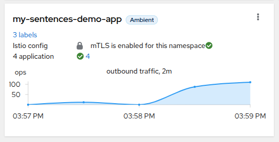
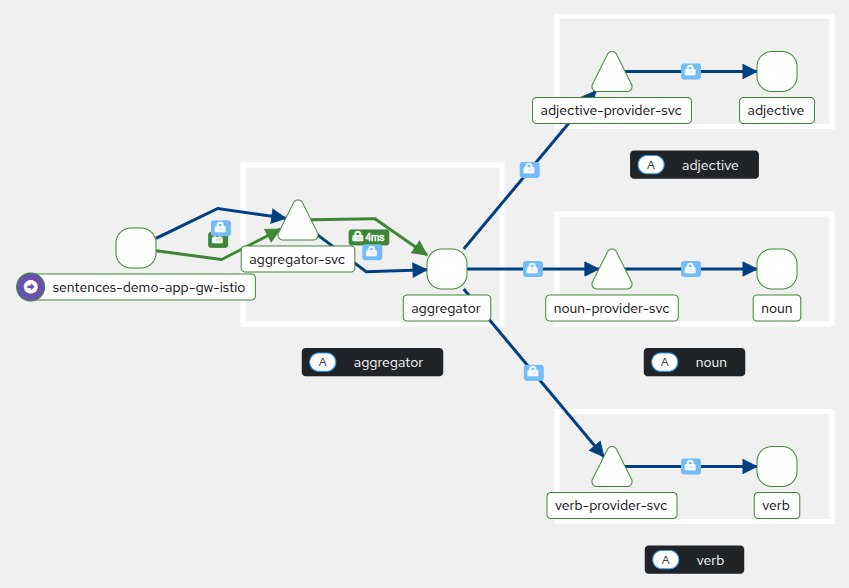

# k8s-security

- [Kubernetes (kind)](#kubernetes-kind)
  - [Create cluster with Istio](#create-cluster-with-istio)
  - [Deploy demo app (sentences generator)](#deploy-demo-app-sentences-generator)
  - [Test the app](#test-the-app)
  - [Test Kyverno policies](#test-kyverno-policies)
    - [Admission policies](#admission-policies)
    - [Mutation policies](#mutation-policies)
- [How to dev - demo app](#how-to-dev---demo-app)
  - [Docker compose run](#docker-compose-run)
  - [Local run](#local-run)
  - [Configuration](#configuration)
    - [Common module](#common-module)
    - [Aggregator](#aggregator)
    - [Provider](#provider)

## Kubernetes (kind)

Prerequisites:
- `kubectl` (obviously)
- [`kind`](https://github.com/kubernetes-sigs/kind)
- [`cloud-provider-kind`](https://github.com/kubernetes-sigs/cloud-provider-kind)
- [`helmfile`](https://github.com/helmfile/helmfile)

### Create cluster with Istio

Create `kind` cluster:

```bash
just kube-cluster-create
```

Install Istio (ambient mode), with kyverno, falco:

```bash
just kube-cluster-init
```

> [!NOTE]
> You will need to start a new shell where you will run `cloud-provider-kind` so that the LoadBalancer, the one created by the Gateway, gets an external IP.

### Deploy demo app (sentences generator)

```bash
just helm-demo-app-install
```

### Test the app

To get the external IP of our service:

```bash
export INGRESS_HOST=$(kubectl get -n my-sentences-demo-app gateway sentences-demo-app-gw -o jsonpath='{.status.addresses[0].value}')
echo $INGRESS_HOST
```

And then you try the app with:

```bash
curl http://$INGRESS_HOST/
```

You can check in Kiali, that the mTLS is enabled in our namespace:

```bash
kubectl port-forward -n istio-system svc/kiali 20001:20001
```

Go to [http://localhost:20001/](http://localhost:20001/), and see the app in Kiali:



And the traffic graph (you need to send some requests to the app to see it):



### Test Kyverno policies

If you want to test all the Kyverno policies more easily, you can use:

```bash
just kyverno-valid-tests kyverno-invalid-tests kyverno-mutate-tests
```

<details>
  <summary>You can access the Kyverno Policy Reporter with:</summary>

```bash
kubectl port-forward -n kyverno svc/policy-reporter-ui 8082:8080
```

And go to [http://localhost:8082/](http://localhost:8082/).

</details>

#### Admission policies

1. ClusterPolicy `check-image`: check that images, coming from `ghcr.io/mfernd/k8s-security*`, has a signature (by `sigstore/cosign`)

```bash
# invalid pod image (does not have a signature)
kyverno apply charts/kubernetes_yaml/kyverno/check-images.cpol.yaml --resource charts/kubernetes_yaml/kyverno/tests/invalid-pod-image.yaml
# valid pod image (latest has a signature)
kyverno apply charts/kubernetes_yaml/kyverno/check-images.cpol.yaml --resource charts/kubernetes_yaml/kyverno/tests/valid-pod.yaml
```

2. ClusterPolicy `require-requests-limits`: check that all pods, in namespaces beginning by `my*` or `app*`, have `requests` and `limits` resources defined

```bash
# invalid pod (does not have requests and limits)
kyverno apply charts/kubernetes_yaml/kyverno/require-requests-limits.cpol.yaml --resource charts/kubernetes_yaml/kyverno/tests/invalid-pod-requests-limits.yaml
# valid pod (has requests and limits)
kyverno apply charts/kubernetes_yaml/kyverno/require-requests-limits.cpol.yaml --resource charts/kubernetes_yaml/kyverno/tests/valid-pod.yaml
```

3. ClusterPolicy `restrict-nodeport`: prevent the use of `NodePort` services

```bash
# invalid service (has NodePort)
kyverno apply charts/kubernetes_yaml/kyverno/restrict-nodeport.cpol.yaml --resource charts/kubernetes_yaml/kyverno/tests/invalid-svc-nodeport.yaml
# valid service (to test that ClusterIP, at least, works)
kyverno apply charts/kubernetes_yaml/kyverno/restrict-nodeport.cpol.yaml --resource charts/kubernetes_yaml/kyverno/tests/valid-svc-clusterip.yaml
```

#### Mutation policies

1. ClusterPolicy `add-default-securitycontext`: add a default `securityContext` to all pods

```bash
kyverno apply charts/kubernetes_yaml/kyverno/add-default-securitycontext.cpol.yaml --resource charts/kubernetes_yaml/kyverno/tests/mutate-pod-security-context.yaml
```

<details>
  <summary>We see that the pod has been patched with a <code>securityContext</code>.</summary>

```
Applying 3 policy rule(s) to 1 resource(s)...

mutate policy add-default-securitycontext applied to default/Pod/nginx:
apiVersion: v1
kind: Pod
metadata:
  name: nginx
  namespace: default
spec:
  containers:
  - image: nginx:1.27.3
    name: nginx
    ports:
    - containerPort: 80
  securityContext:
    fsGroup: 2000
    runAsGroup: 3000
    runAsNonRoot: true
    runAsUser: 1000

---

pass: 1, fail: 0, warn: 0, error: 0, skip: 0
```

</details>

2. ClusterPolicy `add-istio-mesh-namespace`: add the `istio.io/dataplane-mode: ambient` label to all namespace beginning by `my*` or `app*`

```bash
kyverno apply charts/kubernetes_yaml/kyverno/add-istio-mesh-ns.cpol.yaml --resource charts/kubernetes_yaml/kyverno/tests/mutate-ns-istio-mesh.yaml
```

<details>
  <summary>We see that the namespace has our new istio label <code>istio.io/dataplane-mode: ambient</code>.</summary>

```
Applying 1 policy rule(s) to 1 resource(s)...

mutate policy add-istio-mesh-namespace applied to default/Namespace/my-namespace:
apiVersion: v1
kind: Namespace
metadata:
  labels:
    istio.io/dataplane-mode: ambient
  name: my-namespace
  namespace: default

---

pass: 1, fail: 0, warn: 0, error: 0, skip: 0
```

</details>

## How to dev - demo app

### Docker compose run

```bash
just up
```

### Local run

```bash
just dev
```

With [`mprocs`](https://github.com/pvolok/mprocs) to execute services in parallel.

### Configuration

#### Common module

Source: [`crates/common/`](./crates/common/)

| Env Var    | Description      | Default                    |
| ---------- | ---------------- | -------------------------- |
| `APP_HOST` | Application host | `"0.0.0.0"`                |
| `APP_PORT` | Application port | `3000` (or `80` in Docker) |

Used by all other modules.

#### Aggregator

Source: [`crates/aggregator-svc/`](./crates/aggregator-svc/)

| Env Var              | Description                                                                                                                | Default |
| -------------------- | -------------------------------------------------------------------------------------------------------------------------- | ------- |
| `APP_WORKERS_CONFIG` | Used to know where to get words (see [`workers_config.example.toml`](./crates/aggregator-svc/workers_config.example.toml)) | N/A     |

#### Provider

Source: [`crates/provider-svc/`](./crates/provider-svc/)

| Env Var             | Description                                                                                                              | Default |
| ------------------- | ------------------------------------------------------------------------------------------------------------------------ | ------- |
| `APP_PROVIDER_KIND` | Define the provider type of the instance (see [struct `WordKind`](./crates/common/src/word_kind.rs) for possible values) | N/A     |
